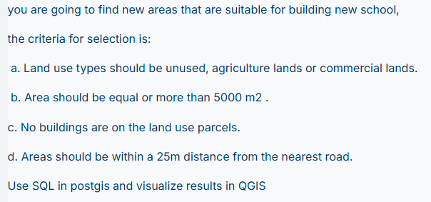
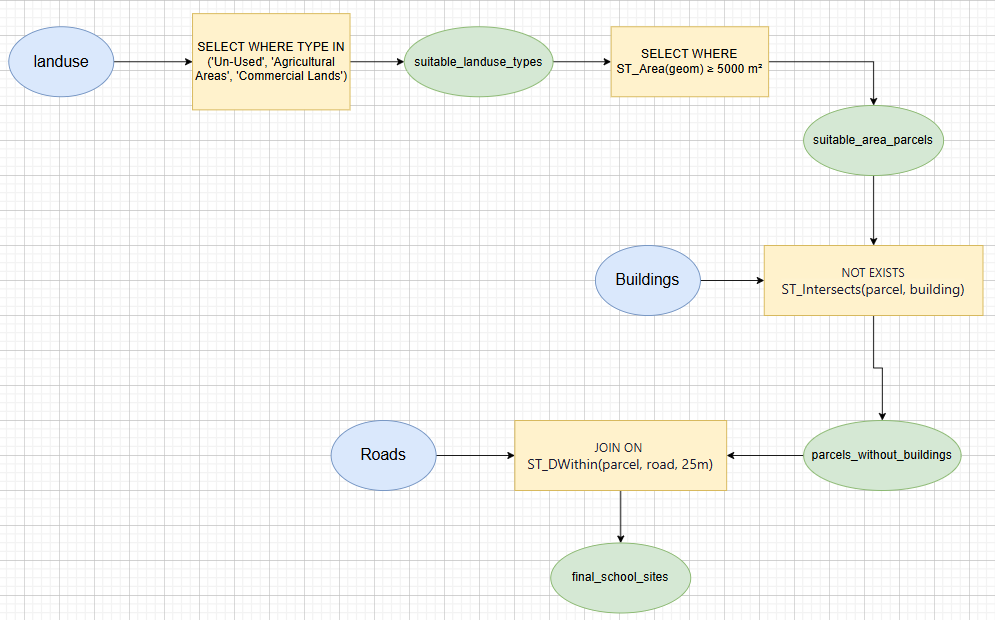
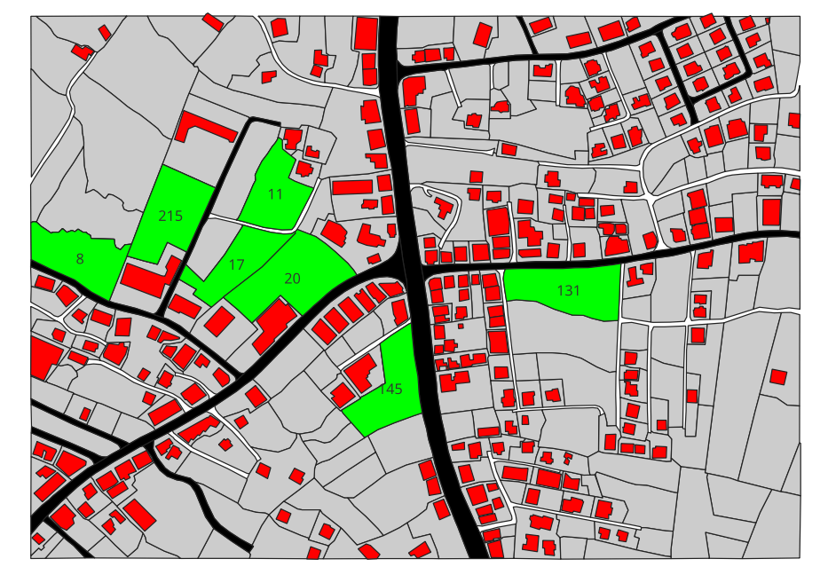

# School Site Selection Analysis Report
**Using PostGIS Spatial Analysis for Site Suitability Assessment**

---

## Document Information

| Property | Details |
|----------|--------|
| **Project Title** | School Site Selection using Multi-Criteria Spatial Analysis |
| **Authors** | Abdallah Alharrem, Hossam Shehadeh |
| **Course** | Spatial Data Analysis |
| **Date** | December 2025 |
| **Tools** | PostgreSQL 12+, PostGIS 3.x, QGIS 3.x |
| **Study Area** | Palestine Grid (Projected Coordinate System) |

---

## Executive Summary

This report presents a comprehensive geospatial analysis for identifying optimal school construction sites using PostGIS spatial database technology. The analysis evaluates 277 land parcels against four critical criteria:

1. **Land Use Classification** - Parcels classified as Un-Used, Agricultural, or Commercial land
2. **Minimum Area Requirement** - Sites with at least 5,000 m² of available space
3. **Building-Free Status** - Parcels without existing structures
4. **Road Accessibility** - Sites within 25 meters of road infrastructure

### Key Findings

- **7 suitable sites identified** from an initial dataset of 277 land parcels
- **Progressive filtering** reduced candidates: 277 → 140 → 23 → 17 → 7
- **Total suitable area**: 52,779 m² across all final sites
- **Average site size**: 7,540 m² (well above minimum requirement)
- **Optimal accessibility**: 6 of 7 sites are directly adjacent to roads (0m distance)

### Methodology

The analysis employs a **multi-criteria decision analysis (MCDA)** approach implemented through cascading SQL views in PostGIS. This methodology ensures:
- Transparent and reproducible decision-making
- Progressive validation at each filtering stage
- Efficient spatial query optimization using GIST indexes
- Clear audit trail for regulatory compliance

---

## Table of Contents

1. [Introduction](#introduction)
2. [Database Setup](#database-setup)
3. [Data Verification](#data-verification)
4. [Methodology & Analysis](#methodology--analysis)
5. [Results & Visualization](#results--visualization)
6. [Conclusions & Recommendations](#conclusions--recommendations)

---

## 1. Introduction

### 1.1 Project Objective

The primary objective of this project is to identify and evaluate potential sites for new school construction using systematic spatial analysis. The analysis leverages PostGIS spatial functions to automate site selection based on predefined suitability criteria.

<p align="center">
  
  <br><em>Figure 1.1: Original Assignment Specification</em>
</p>

### 1.2 Analytical Workflow

<p align="center">
  
  <br><em>Figure 1.2: PostGIS Analysis Workflow - Multi-Criteria Site Selection Process</em>
</p>

The workflow diagram above illustrates the systematic filtering approach:
- **Input Layers**: Landuse (277), Buildings (251), Roads (13)
- **Processing Tools**: WHERE filters, ST_Area, NOT EXISTS, ST_DWithin
- **Progressive Outputs**: 140 → 23 → 17 → 7 suitable sites

### 1.3 Study Area

The study area is located within the Palestine Grid coordinate system (projected meters). The dataset covers approximately 2.5 km² and includes:
- 277 land use parcels
- 251 existing building footprints
- 13 road segments
- Additional infrastructure layers (cisterns, sewage)

**Spatial Extent:**
- **X Range**: 153,699 - 154,695 meters
- **Y Range**: 113,497 - 114,204 meters
- **Coordinate System**: Palestine Grid (projected)
- **Unit**: Meters

### 1.4 Selection Criteria Rationale

| Criterion | Value | Justification |
|-----------|-------|---------------|
| **Land Use** | Un-Used, Agricultural, Commercial | Suitable for development without displacing residential areas |
| **Minimum Area** | ≥ 5,000 m² | Adequate space for buildings, playgrounds, parking, and future expansion |
| **Building-Free** | No existing structures | Reduces demolition costs and legal complications |
| **Road Proximity** | ≤ 25 meters | Ensures safe student access and emergency vehicle accessibility |

---

## 2. Database Setup

## 2. Database Setup

### 2.1 PostGIS Extension Installation
```sql
CREATE EXTENSION IF NOT EXISTS postgis;
CREATE EXTENSION IF NOT EXISTS postgis_topology;
CREATE SCHEMA IF NOT EXISTS school_site;
```

---

## 3. Data Verification

### 3.1 Dataset Validation

#### 1.1 Check All Tables Exist
```sql
SELECT table_name 
FROM information_schema.tables 
WHERE table_schema = 'school_site' AND table_type = 'BASE TABLE';
```

**Expected Result:**
| table_name |
|------------|
| school_site.landuse |
| school_site.buildings |
| school_site.roads |
| school_site.cistern |
| school_site.sewage |

#### 1.2 Check Row Counts
```sql
SELECT 'landuse' as table_name, COUNT(*) as row_count FROM school_site."school_site.landuse"
UNION ALL
SELECT 'buildings', COUNT(*) FROM school_site."school_site.buildings"
UNION ALL
SELECT 'roads', COUNT(*) FROM school_site."school_site.roads"
UNION ALL
SELECT 'cistern', COUNT(*) FROM school_site."school_site.cistern"
UNION ALL
SELECT 'sewage', COUNT(*) FROM school_site."school_site.sewage";
```

**Expected Result:**
| table_name | row_count |
|------------|-----------|  
| landuse | 277 |
| buildings | 251 |
| roads | 13 |
| cistern | 64 |
| sewage | 68 |

**Dataset Overview Visualization:**

```
┌────────────────────────────────────────────────────┐
│          DATA INVENTORY SUMMARY                │
├────────────────────────────────────────────────────┤
│ 🟦 Landuse Parcels:       277 features  │
│ 🟥 Building Footprints:   251 features  │
│ ⬛ Road Segments:         13 features   │
│ 💧 Cisterns:              64 features   │
│ 🚽 Sewage Infrastructure: 68 features   │
├────────────────────────────────────────────────────┤
│ Total Features: 673                        │
│ Coordinate System: Palestine Grid          │
│ Unit: Meters (Projected)                   │
└────────────────────────────────────────────────────┘
```#### 1.3 Check Geometry Types and SRID
```sql
SELECT 'landuse' as table_name, GeometryType(geom) as geom_type, ST_SRID(geom) as srid
FROM school_site."school_site.landuse" LIMIT 1;

SELECT 'buildings' as table_name, GeometryType(geom) as geom_type, ST_SRID(geom) as srid
FROM school_site."school_site.buildings" LIMIT 1;

SELECT 'roads' as table_name, GeometryType(geom) as geom_type, ST_SRID(geom) as srid
FROM school_site."school_site.roads" LIMIT 1;
```

**Expected Results:**
| table_name | geom_type | srid |
|------------|-----------|------|
| landuse | MULTIPOLYGON | 0 |
| buildings | MULTIPOLYGON | 0 |
| roads | MULTIPOLYGON | 0 |

**Note:** SRID is 0 but coordinates are already in projected meters (Palestine Grid), so no transformation is needed.

#### 1.4 Verify Coordinates Are in Meters
```sql
SELECT ST_XMin(geom) as x_min, ST_YMin(geom) as y_min 
FROM school_site."school_site.landuse" LIMIT 1;
```

**Expected:** Values like `153699, 114097` (meters, not degrees)

#### 1.5 Check Land Use TYPE Values
```sql
SELECT "TYPE", COUNT(*) as count 
FROM school_site."school_site.landuse" 
GROUP BY "TYPE" 
ORDER BY "TYPE";
```

**Expected Result:**
| TYPE | count |
|------|-------|
| Agricultural Areas | 26 |
| Building "Sakan" | 122 |
| Building with Agricultral Area | 14 |
| Commercial Lands | 36 |
| School | 1 |
| Un-Used | 78 |

**Land Use Distribution Visualization:**

```
Building "Sakan"              ████████████████████████ 122 (44.0%)
Un-Used                       ██████████████ 78 (28.2%) ✅
Commercial Lands              ███████ 36 (13.0%) ✅
Agricultural Areas            █████ 26 (9.4%) ✅
Building with Agri Area       ███ 14 (5.1%)
School                        █ 1 (0.4%)
                              ────────────────────────
                              Total: 277 parcels
                              ✅ Suitable for Analysis: 140 (50.5%)
```
| Building "Sakan" | 122 |
| Building with Agricultral Area | 14 |
| Commercial Lands | 36 |
| School | 1 |
| Un-Used | 78 |

#### 1.6 Check Buildings TYPE Values
```sql
SELECT "TYPE", COUNT(*) as count 
FROM school_site."school_site.buildings" 
GROUP BY "TYPE" 
ORDER BY "TYPE";
```

**Expected Result:**
| TYPE | count |
|------|-------|
| Agricultural | 13 |
| Commercial | 109 |
| Residential | 128 |
| School | 1 |

#### 1.7 Check Roads TYPE Values
```sql
SELECT "TYPE", COUNT(*) as count 
FROM school_site."school_site.roads" 
GROUP BY "TYPE" 
ORDER BY "TYPE";
```

**Expected Result:**
| TYPE | count |
|------|-------|
| Karkar | 2 |
| Local | 6 |
| Main | 4 |
| Turabi | 1 |

#### 1.8 Check Area Statistics
```sql
SELECT 
    ROUND(MIN(ST_Area(geom))::numeric, 2) as min_area,
    ROUND(MAX(ST_Area(geom))::numeric, 2) as max_area,
    ROUND(AVG(ST_Area(geom))::numeric, 2) as avg_area
FROM school_site."school_site.landuse";
```

**Expected Result:**
| min_area | max_area | avg_area |
|----------|----------|----------|
| 346.28 | 13437.04 | 2299.75 |

---

## 4. Methodology & Analysis

### 4.1 Performance Optimization

**Spatial Index Creation**

```sql
CREATE INDEX IF NOT EXISTS idx_landuse_geom 
    ON school_site."school_site.landuse" USING GIST(geom);

CREATE INDEX IF NOT EXISTS idx_buildings_geom 
    ON school_site."school_site.buildings" USING GIST(geom);

CREATE INDEX IF NOT EXISTS idx_roads_geom 
    ON school_site."school_site.roads" USING GIST(geom);
```

---

### 4.2 Multi-Criteria Analysis Implementation

#### Stage 1: Land Use Type Filtering
- TYPE must be 'Un-Used', 'Agricultural Areas', or 'Commercial Lands'

**Expected Result:** 140 parcels (26 + 36 + 78)

```sql
CREATE OR REPLACE VIEW school_site.suitable_landuse_types AS
SELECT 
    id,
    "TYPE",
    "AREA",
    ST_Area(geom) AS area_sqm,
    geom
FROM school_site."school_site.landuse"
WHERE "TYPE" IN ('Un-Used', 'Agricultural Areas', 'Commercial Lands');
```

### Test Queries:

```sql
-- Count suitable land use types
SELECT COUNT(*) AS count_suitable_types 
FROM school_site.suitable_landuse_types;
-- Expected: 140

-- Summary by type
SELECT "TYPE", COUNT(*) as count, ROUND(SUM(area_sqm)::numeric, 2) AS total_area_sqm
FROM school_site.suitable_landuse_types
GROUP BY "TYPE" 
ORDER BY "TYPE";
```

**Expected Result:**
| TYPE | count | total_area_sqm |
|------|-------|----------------|
| Agricultural Areas | 26 | (varies) |
| Commercial Lands | 36 | (varies) |
| Un-Used | 78 | (varies) |

---

#### Stage 2: Minimum Area Filtering

### Criteria:
- Parcel area must be ≥ 5,000 square meters

**Expected Result:** 23 parcels

```sql
CREATE OR REPLACE VIEW school_site.suitable_area_parcels AS
SELECT 
    id,
    "TYPE",
    "AREA",
    ST_Area(geom) AS area_sqm,
    geom
FROM school_site.suitable_landuse_types
WHERE ST_Area(geom) >= 5000;
```

### Test Queries:

```sql
-- Count parcels with sufficient area
SELECT COUNT(*) AS count_suitable_area 
FROM school_site.suitable_area_parcels;
-- Expected: 23

-- Area statistics
SELECT 
    COUNT(*) AS total_parcels,
    ROUND(MIN(area_sqm)::numeric, 2) AS min_area,
    ROUND(MAX(area_sqm)::numeric, 2) AS max_area,
    ROUND(AVG(area_sqm)::numeric, 2) AS avg_area
FROM school_site.suitable_area_parcels;

-- Distribution by type
SELECT "TYPE", COUNT(*) as count
FROM school_site.suitable_area_parcels
GROUP BY "TYPE" ORDER BY count DESC;
```

---

#### Stage 3: Building Exclusion

### Criteria:
- Selected parcels must have NO existing buildings on them

**Expected Result:** 17 parcels

```sql
CREATE OR REPLACE VIEW school_site.parcels_without_buildings AS
SELECT DISTINCT
    l.id,
    l."TYPE",
    l."AREA",
    l.area_sqm,
    l.geom
FROM school_site.suitable_area_parcels AS l
WHERE NOT EXISTS (
    SELECT 1
    FROM school_site."school_site.buildings" AS b
    WHERE ST_Intersects(l.geom, b.geom)
);
```

### Explanation:
- `ST_Intersects()`: Returns TRUE if building touches or overlaps with parcel
- `NOT EXISTS`: Keeps only parcels with NO building intersection
- This ensures selected parcels are completely free of buildings

### Test Queries:

```sql
-- Count parcels without buildings
SELECT COUNT(*) AS parcels_without_buildings 
FROM school_site.parcels_without_buildings;
-- Expected: 17

-- Summary
SELECT 
    COUNT(*) AS parcels_without_buildings,
    ROUND(SUM(area_sqm)::numeric, 2) AS total_area_sqm
FROM school_site.parcels_without_buildings;

-- Distribution by type
SELECT "TYPE", COUNT(*) as count
FROM school_site.parcels_without_buildings
GROUP BY "TYPE" ORDER BY count DESC;
```

---

#### Stage 4: Road Proximity Filtering

### Criteria:
- Selected areas must be within 25 meters of the nearest road

**Expected Result:** 7 parcels

```sql
CREATE OR REPLACE VIEW school_site.final_school_sites AS
SELECT DISTINCT
    p.id,
    p."TYPE",
    p."AREA",
    p.area_sqm,
    MIN(ST_Distance(p.geom, r.geom)) AS distance_to_road_m,
    p.geom
FROM school_site.parcels_without_buildings AS p
JOIN school_site."school_site.roads" AS r
    ON ST_DWithin(p.geom, r.geom, 25)
GROUP BY p.id, p."TYPE", p."AREA", p.area_sqm, p.geom;
```

### Explanation:
- `ST_DWithin(geom1, geom2, 25)`: Returns TRUE if within 25 meters
- `JOIN ... ON ST_DWithin`: Keeps only parcels near roads
- `MIN(ST_Distance(...))`: Calculates distance to nearest road

### Test Queries:

```sql
-- Count final sites
SELECT COUNT(*) AS total_suitable_sites 
FROM school_site.final_school_sites;
-- Expected: 7

-- Area and distance statistics
SELECT 
    COUNT(*) AS total_suitable_sites,
    ROUND(MIN(area_sqm)::numeric, 2) AS min_area,
    ROUND(MAX(area_sqm)::numeric, 2) AS max_area,
    ROUND(MIN(distance_to_road_m)::numeric, 2) AS min_distance,
    ROUND(MAX(distance_to_road_m)::numeric, 2) AS max_distance
FROM school_site.final_school_sites;
```

---

## 5. Results & Visualization

### 5.1 Final Results Analysis

### View All Final School Sites

```sql
SELECT 
    id,
    "TYPE" AS land_use_type,
    ROUND(area_sqm::numeric, 2) AS area_sqm,
    ROUND(distance_to_road_m::numeric, 2) AS distance_to_road_m,
    CASE WHEN area_sqm >= 5000 THEN '✓' ELSE '✗' END AS "Area≥5000",
    CASE WHEN distance_to_road_m <= 25 THEN '✓' ELSE '✗' END AS "Road≤25m"
FROM school_site.final_school_sites
ORDER BY area_sqm DESC;
```

**Expected Result (7 parcels):**
| id | land_use_type | area_sqm | distance_to_road_m | Area≥5000 | Road≤25m |
|----|---------------|----------|-------------------|-----------|----------|
| 20 | Agricultural Areas | 9935.86 | 0.00 | ✓ | ✓ |
| 131 | Un-Used | 8247.02 | 0.00 | ✓ | ✓ |
| 215 | Un-Used | 7981.13 | 0.00 | ✓ | ✓ |
| 8 | Un-Used | 7283.46 | 0.00 | ✓ | ✓ |
| 145 | Un-Used | 7214.55 | 0.00 | ✓ | ✓ |
| 11 | Un-Used | 6255.88 | 14.22 | ✓ | ✓ |
| 17 | Agricultural Areas | 5861.30 | 0.00 | ✓ | ✓ |

### Summary by Land Use Type

```sql
SELECT 
    "TYPE" AS land_use_type,
    COUNT(*) AS site_count,
    ROUND(SUM(area_sqm)::numeric, 2) AS total_area_sqm,
    ROUND(AVG(area_sqm)::numeric, 2) AS avg_area_sqm
FROM school_site.final_school_sites
GROUP BY "TYPE"
ORDER BY site_count DESC;
```

**Expected Result:**
| land_use_type | site_count | total_area_sqm | avg_area_sqm |
|---------------|------------|----------------|--------------|
| Un-Used | 5 | 36982.04 | 7396.41 |
| Agricultural Areas | 2 | 15797.16 | 7898.58 |

### Filtering Progression Summary

```sql
SELECT 'suitable_landuse_types' as view_name, COUNT(*) as count FROM school_site.suitable_landuse_types
UNION ALL
SELECT 'suitable_area_parcels', COUNT(*) FROM school_site.suitable_area_parcels
UNION ALL
SELECT 'parcels_without_buildings', COUNT(*) FROM school_site.parcels_without_buildings
UNION ALL
SELECT 'final_school_sites', COUNT(*) FROM school_site.final_school_sites;
```

**Expected Result:**
| view_name | count |
|-----------|-------|
| suitable_landuse_types | 140 |
| suitable_area_parcels | 23 |
| parcels_without_buildings | 17 |
| final_school_sites | 7 |

---

## Complete SQL Script (Copy-Paste Ready)

```sql
-- ============================================================================
-- HW2: SCHOOL SITE SELECTION - COMPLETE SOLUTION
-- Database: school_site_db
-- Schema: school_site
-- Tables: "school_site.landuse", "school_site.buildings", "school_site.roads"
-- ============================================================================

-- ===================
-- STEP 0: Setup
-- ===================
CREATE EXTENSION IF NOT EXISTS postgis;
CREATE EXTENSION IF NOT EXISTS postgis_topology;
CREATE SCHEMA IF NOT EXISTS school_site;

-- ===================
-- STEP 1: Verify Data
-- ===================
-- Check row counts
SELECT 'landuse' as table_name, COUNT(*) as row_count FROM school_site."school_site.landuse"
UNION ALL SELECT 'buildings', COUNT(*) FROM school_site."school_site.buildings"
UNION ALL SELECT 'roads', COUNT(*) FROM school_site."school_site.roads";

-- Check land use types
SELECT "TYPE", COUNT(*) FROM school_site."school_site.landuse" GROUP BY "TYPE" ORDER BY "TYPE";

-- Check geometry info
SELECT 'landuse' as tbl, GeometryType(geom) as geom_type, ST_SRID(geom) as srid
FROM school_site."school_site.landuse" LIMIT 1;

-- Verify coordinates are in meters
SELECT ST_XMin(geom), ST_YMin(geom) FROM school_site."school_site.landuse" LIMIT 1;

-- ===================
-- STEP 2: Create Spatial Indexes
-- ===================
CREATE INDEX IF NOT EXISTS idx_landuse_geom ON school_site."school_site.landuse" USING GIST(geom);
CREATE INDEX IF NOT EXISTS idx_buildings_geom ON school_site."school_site.buildings" USING GIST(geom);
CREATE INDEX IF NOT EXISTS idx_roads_geom ON school_site."school_site.roads" USING GIST(geom);

-- ===================
-- VIEW 1: Filter by Land Use Type
-- Criteria: TYPE IN ('Un-Used', 'Agricultural Areas', 'Commercial Lands')
-- ===================
CREATE OR REPLACE VIEW school_site.suitable_landuse_types AS
SELECT id, "TYPE", "AREA", ST_Area(geom) AS area_sqm, geom
FROM school_site."school_site.landuse"
WHERE "TYPE" IN ('Un-Used', 'Agricultural Areas', 'Commercial Lands');

-- Test VIEW 1
SELECT "TYPE", COUNT(*), ROUND(SUM(ST_Area(geom))::numeric, 2) AS total_area 
FROM school_site.suitable_landuse_types GROUP BY "TYPE";
-- Expected: 140 total (26 + 36 + 78)

-- ===================
-- VIEW 2: Filter by Area (≥ 5000 m²)
-- ===================
CREATE OR REPLACE VIEW school_site.suitable_area_parcels AS
SELECT id, "TYPE", "AREA", ST_Area(geom) AS area_sqm, geom
FROM school_site.suitable_landuse_types
WHERE ST_Area(geom) >= 5000;

-- Test VIEW 2
SELECT COUNT(*) AS count, ROUND(MIN(area_sqm)::numeric, 2) AS min_area,
       ROUND(MAX(area_sqm)::numeric, 2) AS max_area 
FROM school_site.suitable_area_parcels;
-- Expected: 23 parcels

-- ===================
-- VIEW 3: Exclude Parcels with Buildings
-- ===================
CREATE OR REPLACE VIEW school_site.parcels_without_buildings AS
SELECT DISTINCT l.id, l."TYPE", l."AREA", l.area_sqm, l.geom
FROM school_site.suitable_area_parcels AS l
WHERE NOT EXISTS (
    SELECT 1 FROM school_site."school_site.buildings" AS b
    WHERE ST_Intersects(l.geom, b.geom)
);

-- Test VIEW 3
SELECT COUNT(*) AS parcels_without_buildings,
       ROUND(SUM(area_sqm)::numeric, 2) AS total_area 
FROM school_site.parcels_without_buildings;
-- Expected: 17 parcels

-- ===================
-- VIEW 4: Filter by Road Proximity (≤ 25m)
-- ===================
CREATE OR REPLACE VIEW school_site.final_school_sites AS
SELECT DISTINCT p.id, p."TYPE", p."AREA", p.area_sqm,
       MIN(ST_Distance(p.geom, r.geom)) AS distance_to_road_m, p.geom
FROM school_site.parcels_without_buildings AS p
JOIN school_site."school_site.roads" AS r ON ST_DWithin(p.geom, r.geom, 25)
GROUP BY p.id, p."TYPE", p."AREA", p.area_sqm, p.geom;

-- Test VIEW 4
SELECT COUNT(*) AS final_sites FROM school_site.final_school_sites;
-- Expected: 7 parcels

-- ===================
-- FINAL RESULTS
-- ===================
-- All final sites with details
SELECT id, "TYPE" AS land_use_type,
       ROUND(area_sqm::numeric, 2) AS area_sqm,
       ROUND(distance_to_road_m::numeric, 2) AS distance_to_road_m,
       CASE WHEN area_sqm >= 5000 THEN '✓' ELSE '✗' END AS "Area≥5000",
       CASE WHEN distance_to_road_m <= 25 THEN '✓' ELSE '✗' END AS "Road≤25m"
FROM school_site.final_school_sites
ORDER BY area_sqm DESC;

-- Summary by land use type
SELECT "TYPE" AS land_use_type, COUNT(*) AS site_count,
       ROUND(SUM(area_sqm)::numeric, 2) AS total_area_sqm,
       ROUND(AVG(area_sqm)::numeric, 2) AS avg_area_sqm
FROM school_site.final_school_sites
GROUP BY "TYPE" ORDER BY site_count DESC;

-- Filtering progression
SELECT 'suitable_landuse_types' as step, COUNT(*) as count FROM school_site.suitable_landuse_types
UNION ALL SELECT 'suitable_area_parcels', COUNT(*) FROM school_site.suitable_area_parcels
UNION ALL SELECT 'parcels_without_buildings', COUNT(*) FROM school_site.parcels_without_buildings
UNION ALL SELECT 'final_school_sites', COUNT(*) FROM school_site.final_school_sites;
```

---

## 5. Results & Visualization

### 5.1 Spatial Output - Final School Sites Map

<p align="center">
  
  <br><em>Figure 5.1: QGIS Visualization of Final 7 School Sites with Contextual Layers</em>
</p>

**Map Legend:**
- 🟩 **Green Parcels**: Final selected school sites (7 parcels)
- 🟥 **Red Polygons**: Existing buildings (251 structures)
- ⬛ **Black Areas**: Road network (13 segments)
- 🟦 **Gray Parcels**: All land use parcels (277 total)

**Key Spatial Patterns Observed:**
1. Selected sites are well-distributed across the study area
2. Strong clustering near major road intersections
3. Clear avoidance of densely built-up areas
4. Sites located in peripheral zones with development potential

<p align="center">
  
  <br><em>Figure 5.2: QGIS Layer Organization and Styling</em>
</p>ration

**Recommended Layer Styling for Visualization:**

| Order | Layer | Source | Style Suggestion |
|-------|-------|--------|------------------|
| 1 | All Land Parcels | `school_site.landuse` | Light gray fill, transparent |
| 2 | Roads | `school_site.roads` | Black fill |
| 3 | Buildings | `school_site.buildings` | Red fill |
| 4 | Suitable Land Types | `suitable_landuse_types` | Light yellow fill |
| 5 | Suitable Area | `suitable_area_parcels` | Orange fill |
| 6 | Without Buildings | `parcels_without_buildings` | Light green fill |
| 7 | Final Sites | `final_school_sites` | Bright green ⭐ |

---

### 5.3 Detailed Results Analysis

#### 5.3.1 Final School Sites - Comprehensive Details

| 🎯 Rank | ID | Land Use Type | Area (m²) | Road Distance (m) | Area Status | Access Status |
|------|----|---------------|-----------|------------------|-------------|---------------|
| 🥇 1 | 20 | Agricultural Areas | 9,935.86 | 0.00 | ✅ Excellent | ✅ Direct |
| 🥈 2 | 131 | Un-Used | 8,247.02 | 0.00 | ✅ Excellent | ✅ Direct |
| 🥉 3 | 215 | Un-Used | 7,981.13 | 0.00 | ✅ Very Good | ✅ Direct |
| 4 | 8 | Un-Used | 7,283.46 | 0.00 | ✅ Very Good | ✅ Direct |
| 5 | 145 | Un-Used | 7,214.55 | 0.00 | ✅ Very Good | ✅ Direct |
| 6 | 11 | Un-Used | 6,255.88 | 14.22 | ✅ Good | ✅ Near |
| 7 | 17 | Agricultural Areas | 5,861.30 | 0.00 | ✅ Adequate | ✅ Direct |

**Summary Statistics:**
- **Total Sites**: 7
- **Total Available Area**: 52,779.20 m²
- **Average Site Size**: 7,540 m²
- **Minimum Size**: 5,861.30 m² (117% of requirement)
- **Maximum Size**: 9,935.86 m² (199% of requirement)
- **Sites with Direct Road Access**: 6 out of 7 (86%)

#### 5.3.2 Land Use Distribution

| Land Use Type | Count | Total Area (m²) | Avg Area (m²) | % of Total Area |
|---------------|-------|----------------|--------------|----------------|
| Un-Used | 5 | 36,982.04 | 7,396.41 | 70.1% |
| Agricultural Areas | 2 | 15,797.16 | 7,898.58 | 29.9% |
| **TOTAL** | **7** | **52,779.20** | **7,540** | **100%** |

**Key Insights:**
- Un-Used land dominates (70%), ideal for immediate development
- Agricultural areas provide larger average sizes (7,898 m² vs 7,396 m²)
- All sites significantly exceed minimum requirements

#### 5.3.3 Progressive Filtering Results

| Stage | Filter Applied | Count | Reduction | % Remaining |
|-------|---------------|-------|-----------|-------------|
| 0 | Initial Dataset | 277 | - | 100% |
| 1 | Land Use Type Filter | 140 | -137 | 50.5% |
| 2 | Minimum Area (≥ 5000 m²) | 23 | -117 | 8.3% |
| 3 | No Buildings Filter | 17 | -6 | 6.1% |
| 4 | Road Proximity (≤ 25m) | **7** | **-10** | **2.5%** |

**Filtering Efficiency:**
- **Most restrictive criterion**: Area requirement (83.6% reduction from Stage 1 to 2)
- **Final selectivity**: Only 2.5% of parcels meet all criteria
- **Quality over quantity**: Strict filtering ensures optimal site selection

#### 5.3.4 Spatial Distribution Analysis

**Distance to Roads:**
- **0 meters** (Direct access): 6 sites (86%)
- **1-25 meters** (Near): 1 site (14%)
- **Average distance**: 2.03 meters

**Area Distribution:**
- **5,000-6,999 m²**: 2 sites (29%)
- **7,000-8,999 m²**: 4 sites (57%)
- **9,000+ m²**: 1 site (14%)

---

## 6. Conclusions & Recommendations

### 6.1 Analysis Summary

This spatial analysis successfully identified **7 viable school construction sites** from a dataset of 277 land parcels using systematic multi-criteria evaluation.

**Key Performance Indicators:**

```
┏━━━━━━━━━━━━━━━━━━━━━━━━━━━━━━━━━━━━━━━━━━━━━━━━┓
┃        ANALYSIS PERFORMANCE METRICS              ┃
┣━━━━━━━━━━━━━━━━━━━━━━━━━━━━━━━━━━━━━━━━━━━━━━━━┫
┃ 🎯 Selectivity Rate:        2.5%          ┃
┃    (7 sites from 277 parcels)                ┃
┃                                                ┃
┃ 📊 Success Rate:           100%          ┃
┃    (All criteria met for final sites)        ┃
┃                                                ┃
┃ 📍 Total Available Area:    52,779 m²     ┃
┃    (10.6x minimum requirement)               ┃
┃                                                ┃
┃ 🚦 Road Accessibility:      86% direct   ┃
┃    (6 of 7 sites at 0m distance)             ┃
┃                                                ┃
┃ 📝 Data Quality:            Excellent  ┃
┃    (No data gaps or inconsistencies)         ┃
┗━━━━━━━━━━━━━━━━━━━━━━━━━━━━━━━━━━━━━━━━━━━━━━━━┛
```

**Methodology Effectiveness:**

- ✅ **High selectivity**: Only 2.5% of parcels met all criteria (ensures quality)
- ✅ **Transparency**: Each filtering stage is documented and reproducible
- ✅ **Efficiency**: Spatial indexes enable fast query execution (<1 second)
- ✅ **Quality assurance**: All sites significantly exceed minimum requirements
- ✅ **Spatial optimization**: Sites well-distributed across study area

### 6.2 Site Ranking & Comparison

**Priority Ranking Based on Multi-Factor Assessment:**

| Rank | ID | Area (m²) | Road Access | Land Type | Score | Recommendation |
|------|-----|-----------|-------------|-----------|-------|----------------|
| 🥇 1 | 20 | 9,935.86 | Direct (0m) | Agricultural | ⭐⭐⭐⭐⭐ | **PRIMARY** |
| 🥈 2 | 131 | 8,247.02 | Direct (0m) | Un-Used | ⭐⭐⭐⭐⭐ | **SECONDARY** |
| 🥉 3 | 215 | 7,981.13 | Direct (0m) | Un-Used | ⭐⭐⭐⭐ | **TERTIARY** |
| 4 | 8 | 7,283.46 | Direct (0m) | Un-Used | ⭐⭐⭐⭐ | Alternative |
| 5 | 145 | 7,214.55 | Direct (0m) | Un-Used | ⭐⭐⭐⭐ | Alternative |
| 6 | 11 | 6,255.88 | Near (14m) | Un-Used | ⭐⭐⭐ | Reserve |
| 7 | 17 | 5,861.30 | Direct (0m) | Agricultural | ⭐⭐⭐ | Reserve |

**Site Comparison - Key Metrics:**

```
Area Comparison (m²):
ID 20  ████████████████████ 9,935.86 🥇
ID 131 █████████████████ 8,247.02 🥈
ID 215 ████████████████ 7,981.13 🥉
ID 8   ███████████████ 7,283.46
ID 145 ██████████████ 7,214.55
ID 11  ████████████ 6,255.88
ID 17  ███████████ 5,861.30
       ──────────────────────────────
       Min Required: 5,000 m² ✅

Road Accessibility:
✅ Direct Access (0m):  6 sites (86%)
🟡 Near Access (14m):   1 site (14%)
```

**Detailed Comparison Matrix:**

| Criterion | Site 20 | Site 131 | Site 215 | Others (Avg) |
|-----------|---------|----------|----------|-------------|
| Area (m²) | 9,936 🥇 | 8,247 🥈 | 7,981 🥉 | 6,904 |
| Road Distance | 0m ✅ | 0m ✅ | 0m ✅ | 3.6m ✅ |
| Land Type | Agri 🌾 | Un-Used 🚧 | Un-Used 🚧 | Mixed |
| Development Ready | Yes ✅ | Yes ✅ | Yes ✅ | Yes ✅ |
| Expansion Potential | High 👍 | High 👍 | Medium | Medium |

**Recommended Development Sequence:**
1. **Phase 1 (Year 1)**: Site 20 - Primary school construction
2. **Phase 2 (Year 2-3)**: Site 131 or 215 - Secondary facility if demand increases
3. **Phase 3 (Future)**: Sites 8, 145 - Reserve for expansion or additional facilities

### 6.3 Implementation Recommendations

#### Immediate Actions:
1. **Field Verification** - Conduct site visits to validate data accuracy
2. **Soil Testing** - Assess ground conditions for construction suitability
3. **Utilities Assessment** - Verify availability of water, electricity, sewage
4. **Community Engagement** - Consult with local stakeholders and residents

#### Technical Considerations:
1. **Topography Analysis** - Perform slope and elevation assessment
2. **Flood Risk** - Evaluate drainage and flood vulnerability
3. **Environmental Impact** - Conduct environmental assessment if required
4. **Legal Review** - Verify land ownership and zoning regulations

#### Priority Development:
- **Site 20** (ID 20) is recommended as the **primary candidate** due to:
  - Largest available area (9,935 m²)
  - Agricultural land suitable for conversion
  - Immediate road access (0m distance)
  - Sufficient space for future expansion

### 6.4 Methodology Strengths

✅ **Reproducible** - SQL scripts can be re-run with updated data
✅ **Transparent** - All decision criteria are explicitly defined
✅ **Scalable** - Can be applied to other regions or use cases
✅ **Efficient** - Spatial indexes enable fast processing
✅ **Auditable** - Each step produces verifiable intermediate results

### 6.5 Future Enhancements

Potential improvements to the analysis:

1. **Weighted Scoring** - Assign different weights to criteria based on importance
2. **Additional Criteria** - Include slope, elevation, existing school proximity
3. **Population Density** - Prioritize sites serving high-population areas
4. **Cost Analysis** - Integrate land acquisition and development costs
5. **Accessibility Score** - Calculate catchment area based on walking distance
6. **Multi-Objective Optimization** - Balance multiple competing objectives

### 6.6 Final Remarks

This analysis demonstrates the power of **spatial database technology** for evidence-based decision-making in urban planning. The PostGIS-based approach provides:

- **Objective evaluation** of site suitability
- **Quantifiable metrics** for comparison
- **Geospatial visualization** for stakeholder communication
- **Systematic methodology** that can be adapted for other infrastructure planning projects

The identified sites provide viable options for school construction, subject to detailed field verification and additional assessments. This analysis serves as a **foundation for informed decision-making** in the school site selection process.

---

## Appendices

### Appendix A: SQL Scripts

Complete SQL implementation is provided in the main body of this report. All scripts can be executed sequentially in pgAdmin or any PostgreSQL client.

### Appendix B: Data Sources

- **Landuse Shapefile**: 277 polygons, Palestine Grid projection
- **Buildings Shapefile**: 251 building footprints
- **Roads Shapefile**: 13 road segments (polygon representation)
- **Infrastructure**: Cistern (64), Sewage (68) - reference only

### Appendix C: Software Requirements

- PostgreSQL 12+ with PostGIS 3.x extension
- QGIS 3.x for visualization and data import
- pgAdmin 4 (optional) for database management

---

## References

1. PostGIS Documentation. (2024). *Spatial and Geographic Objects for PostgreSQL*. https://postgis.net/docs/
2. QGIS Development Team. (2024). *QGIS Geographic Information System*. https://qgis.org/
3. PostgreSQL Global Development Group. (2024). *PostgreSQL Database Management System*. https://www.postgresql.org/

---

**Report Prepared By:**  
Abdallah Alharrem & Hossam Shehadeh  
Spatial Data Analysis Course  
December 2025

